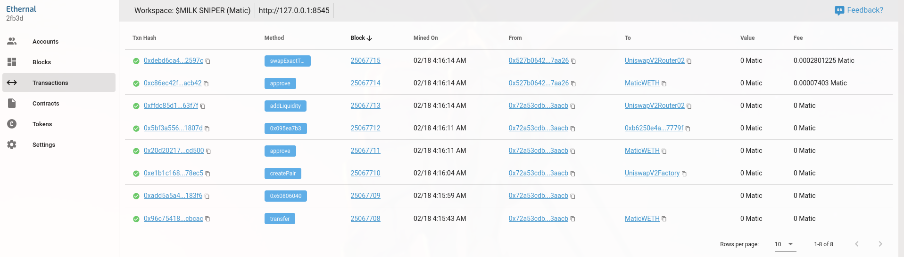

# Listing Sniping Bot
When a new token gets listed on a DEX, bots are able to detect the **PairCreated event emitted from the DEX's factory contract.** This information can be used in the bot's favour by allowing them to be one of the first to buy the newly listed token at a **very low price.**

This repo explores this idea by showing an implementation of a bot that snipes **specific** tokens as soon as they are listed. This bot works under the assumption that **the name of the token to snipe is known before launch.** 

If there is enough public interest in the token during launch day, the bot has potential to be profitable.

[Bot Preview](https://twitter.com/i/status/1494781960350314507)

## Technolody Stack & Tools
- Javascript (bot & testing scripts)
- [Node.js](https://nodejs.org/en/docs/guides/) (js runtime envrionment for scripts)
- [Ethers.js](https://docs.ethers.io/v5/) (blockchain interaction)
- [Ganache](https://github.com/trufflesuite/ganache-cli-archive) (cli based personal local blockchain simulator)
- [Alchemy](https://docs.alchemy.com/alchemy/) (node provider)
- [Ethernal](https://doc.tryethernal.com/) (local blockchain explorer [optional])

## How To Run The Bot
### Installation
To install this repo and all its dependencies run
```
git clone https://github.com/NME-eth/Listing-Sniping-Bot
cd Listing-Sniping-Bot
npm install
```
### Setup & Config
This project uses [dotenv](https://github.com/motdotla/dotenv#readme) to handle all config variables. To set it up, create a `.env` file in the **project home directory** and edit it to include the following variables:
- `MNEMONIC` 12 word mnemonic phrase for a HDWallet
- `NODE_URL` **http url** of the node that the bot will connect to
- `ROUTER_ADDR` dex router address
- `FACTORY_ADDR` dex factory address
- `TOKEN_IN_ADDR` address of token we are sending to router (e.g Eth/Matic/Dai)
- `TOKEN_OUT_NAME` **name of the token that we want to snipe**
- `SELL_AMT` amount of token that we want to send to router (amount of token_in to swap)
- `MIN_LIQUIDITY` the minimum amount of liquidity the pool needs for a trade to be executed
- `IMPERSONATE` whale address used for testing to create initial liquidity pool

an example of a `.env` config file 
```
MNEMONIC=<12-work-mnemonic-here>
NODE_URL=<node-provider-url-here>
ROUTER_ADDR=0x7a250d5630B4cF539739dF2C5dAcb4c659F2488D # uni router
FACTORY_ADDR=0x5C69bEe701ef814a2B6a3EDD4B1652CB9cc5aA6f # uni factory
TOKEN_IN_ADDR=0xC02aaA39b223FE8D0A0e5C4F27eAD9083C756Cc2 # weth addr
TOKEN_OUT_NAME=<name-of-token-to-snipe>
SELL_AMT=10 # swap 10weth for the token we want to snipe
MIN_LIQUIDITY=100 # pool needs atleast 100 weth for bot to make trade
IMPERSONATE=0xE78388b4CE79068e89Bf8aA7f218eF6b9AB0e9d0 # avax bridge 
```
>It makes most sense to use a highly liquid token such as weth/matic/dai/... for the value of `TOKEN_IN_ADDR` so that the bot won't be hit as hard by slippage when swapping

>`MIN_LIQUIDITY` stops the bot from buying fake tokens with the same name as the token we are trying to snipe because the pair's pool reserves need to meet a certain threshold. Should be pretty high e.g. 200eth

### Running 
Once the `.env` file is set up, the bot can be run by calling the following command from the project home directory
```
node src/bot.js
```

# Testing On A Local Blockchain Instance 
To create a **realistic test environment**, we will be using ganache to create a local blockchain state by **forking the mainnet** which will then allow us to simulate sniping the $MILK token. 

### Background Info & Testing Procedure
$MILK is the native currency of the [Cool Cats](https://www.coolcatsnft.com/) NFT project. The token was announced to launch on the **Polygon** Network on **QuickSwap** through a **Weth/Milk token pair**. Our test will be conducted by executing the following steps:

1. Use the ganache to create a local blockchain by forking the polygon mainnet 
2. Set up the `.env` file with all the appropriate variables for the bot to run on the new local blockchain
3. Run the sniping bot
4. Create a dummy erc20 token with the name/symbol MILK
4. Create a new token pair on quickswap for WETH/MILK
5. Add liquidity to our WETH/MILK token pair
6. If the bot works it should detect the pair added as well as the liquidty and should send a transaction to snipe $MILK
 
### Setting Up Ganache
If you have not installed `ganache` install it
```
npm install ganache --global
```

Open a terminal and run `ganache` with the following parameters
- `-f` to fork the polygon mainnet. 
- `-u` to unlock a weth whale's address (we will use this account to create and add liquidity to the weth/milk pair)
```
ganache -f https://polygon-mainnet.g.alchemy.com/v2/<your-alchemy-api-key-here> \
        -u 0x72A53cDBBcc1b9efa39c834A540550e23463AAcB
```
>Replace the whale addr if they no longer hold weth 

>I reccomend using [alchemy](https://docs.alchemy.com/alchemy/) as your provider especially when creating mainnet forks, because of their caching

### Setting Up The .env File
Set up the `.env` file with the following variables for the test to work
```
MNEMONIC=<12-work-mnemonic-here>
NODE_URL=http://127.0.0.1:8545 # ganache rpc url
ROUTER_ADDR=0xa5E0829CaCEd8fFDD4De3c43696c57F7D7A678ff # quickswap router
FACTORY_ADDR=0x5757371414417b8C6CAad45bAeF941aBc7d3Ab32 # uni factory
TOKEN_IN_ADDR=0x7ceB23fD6bC0adD59E62ac25578270cFf1b9f619 # weth addr
TOKEN_OUT_NAME=MILK
SELL_AMT=10 
MIN_LIQUIDITY=100 
IMPERSONATE=0x72A53cDBBcc1b9efa39c834A540550e23463AAcB # unlocked whale acc
```

### Running The Bot
Open a new terminal instance and run the bot. The bot script should be **called from the project home directory**.
```
node src/bot.js
```
>Take note of the signer address on your terminal output

#### (optional) adding funds 
If your signer address does not have 10 WETH at the time of fork, we can transfer 100 WETH to the signer from the unlocked weth whale account. To do so, run the following.
```
node testscripts/fund-account.js <your-signer-address-here> 100
```
>This script should be called from the project home directory

### Simulate $MILK Listing
Open a new terminal and run the following script. This next script will use the unlocked whale account to deploy a dummy $MILK token. It will then create a MILK/WETH pair through the quickswap factory. Then it will provide liquidty to the pair using 200 Weth and 60M Milk.
```
node testscripts/dummy-add-liquidity.js 
```

The `node src/bot.js` process should have detected the added liquidity and should have swapped WETH to MILK.

### Exploring TX On Local Network
We can use [Ethernal](https://doc.tryethernal.com/) to set up a blockchain explorer for our ganache test network. Ethernal is especially useful as a local blockchain explorer as there is no need to set up a truffle/hardhat project just to view transactional data.

Ethernal can be set up by following the steps outlined [here](https://doc.tryethernal.com/getting-started/quickstart). Once it is set up, you can import mainnet contracts and see all transaction/block details.

Preview of Ethernal's interface


## Contribution
If you find any issues or ways to improve this project, create a pull request and it will be merged into the main branch if accepted.

Credits to Julien from ETB as their repo [here](https://github.com/jklepatch/eattheblocks/tree/master/screencast/322-uniswap-trading-bot) helped massively in builing this project.

*This repo has been created for educational purposes and as a tool for myself and others to learn how to implement various web3 tools to conduct tasks such as writing/deploying/testing/interacting with smart contracts. **I do not endorse the usage of bots to gain an unfair advantage over regular onchain users.***
